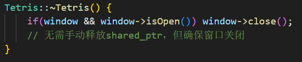
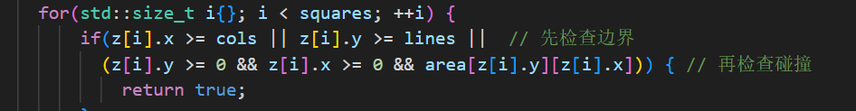
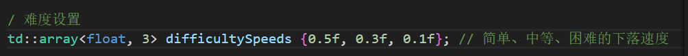
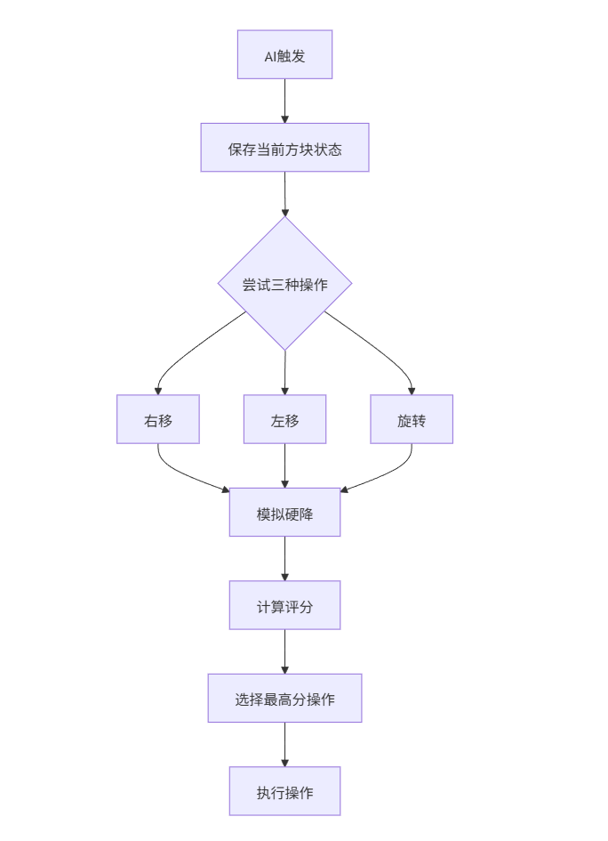
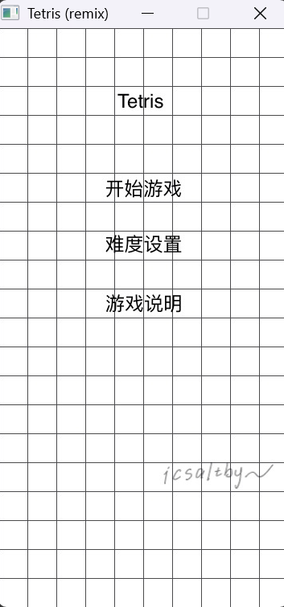
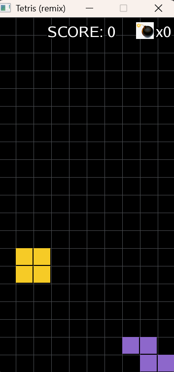

# tetris_icsalt
based https://github.com/terroo/tetris
# <center>俄罗斯方块</center>

## 背景介绍
以[\[text\](https://github.com/terroo/tetris)](https://github.com/terroo/tetris)为基础的优化升级，
原来的代码基础文件为
- tetris.hpp: 游戏常量定义和声明
- tetris.cpp: 初始化和创建
- main.cpp: 创建实例和运行

本项目在此基础上的工作任务：
- 修补可能的漏洞(例如内存或资源泄漏)
- 增添不同的游戏难度
- 增加炸弹功能(清除第一行方块)
- 增加AI算法(俄罗斯方块的自动移动与摆放)

所用技术：同原项目Famous puzzle game remade with C++ and SFML

## 审查修补代码

### 析构函数声明
原代码依赖shared_ptr自动释放，但SFML的sf::RenderWindow可能在程序退出时仍未关闭，导致GPU资源未正确释放。
因此显式关闭窗口确保SFML内部资源（如OpenGL上下文）被清理。


### 数组访问保护（maxLimit函数）
原代码area[z[i].y][z[i].x]可能越界访问（如旋转后x<0或y>=lines）。因此严格检查边界后再访问数组，避免崩溃。


### 新增头文件
原代码隐式依赖这些头文件（如std::to_string来自*string*），跨平台编译时可能出现"未声明标识符"错误。因此显式声明依赖，确保可移植性。

在hpp文件增加了*cstdlib*库，在cpp文件增加了*cstdlib*和*string*库。

## 界面设置
新增了主界面，其有三个选项：**开始游戏**、**难度设置**和**游戏说明**按键。

点击开始游戏即为标准（中等）难度进行游戏，期间可以按ESC返回至主界面调整“难度设置”继续游戏。(添加游戏状态枚举)

每获得3个积分可以获得1颗炸弹，使用1颗炸弹可以消掉第一行的方块。

按A可以切换AI进行游戏，再按A则取消AI模式。

## 

## 难度设置

设置了简单、中等、困难三个选项，方块下落速度由慢到快。
(枚举难度级别状态)


## 炸弹功能

人生总有再来一次一定会赢的想法，因此在游戏里设置了后面努力弥补前面不足：每获得3个积分可以获得1颗炸弹，使用1颗炸弹可以消掉第一行的方块。

### 算法实现

```c++
void Tetris::useBomb() {
    if (bombs <= 0) return;

    // 1. 清除最底部一行（第0行）
    for (int j = 0; j < cols; ++j) 
        area[0][j] = 0;

    // 2. 所有方块下移一行
    for (int i = 0; i < lines-1; ++i)      // 从顶部向底部遍历
        for (int j = 0; j < cols; ++j)
            area[i][j] = area[i+1][j];     // 上一行继承下一行数据

    // 3. 清空顶部行（避免残留数据）
    for (int j = 0; j < cols; ++j)
        area[lines-1][j] = 0;

    bombs--;
    updateBombsDisplay();
}
```
很简单的遍历实现：用炸弹则把最底部一行删了，然后上面的第n+1行覆盖第n行.最顶部一行清零。

## 加入AI算法功能实现自动游戏


基于贪心算法（Greedy Algorithm）​​，结合了​​启发式评估函数实现。

我设置了偏向于右边放置(因为是左上角生成，这样关闭AI还能更好地继续游戏)，核心便是平整度评估。

评估函数 evaluateFlatness()：
```
// 评估标准：表面平整度
int maxHeight = *std::max_element(columnHeights.begin(), columnHeights.end());
int minHeight = *std::min_element(columnHeights.begin(), columnHeights.end());
return -(maxHeight - minHeight); // 高度差越小，得分越高
```
作用原理​​：扫描每列高度（从底部向上找第一个方块），计算最高列与最低列的差值。

​​返回值​​：差值越小（负得越少）表示越平整。

决策逻辑 simpleAI()：
```
// 评分公式（关键平衡点！）
opt.score = evaluateFlatness() + (z[0].x - cols/2); 
//          平整度权重          + 右侧倾向权重
```
基础分：evaluateFlatness()的平整度得分，附加分：(z[0].x - cols/2)（方块越靠右，加分越多）。

最终选择​​综合得分最高​​的操作

## 效果展示

### 编译环境说明
- vscode：1.101.0
- sfml：SFML2.6.0
- c++：winlibs-x86_64-posix-seh-gcc-14.2.0-llvm-19.1.7-mingw-w64msvcrt-12.0.0-r3

### 界面展示
进入界面：



难度设置界面和游戏说明界面类似

### 运行界面展示及描述


方块从左上角出现并下落，消一行得一分，每得三分获得一个炸弹。

按A可进入AI模式，再按A取消。

按ECS可退回选择难度。

### 视频链接
https://www.bilibili.com/video/BV1ugM8zqE79/?vd_source=74a5735c1064ac78efb8ce06cdc8c11c

### 源代码


## 参考
- 项目基础：https://github.com/terroo/tetris
- sfml：SFML2.6.0
- c++：winlibs-x86_64-posix-seh-gcc-14.2.0-llvm-19.1.7-mingw-w64msvcrt-12.0.0-r3
- llm
